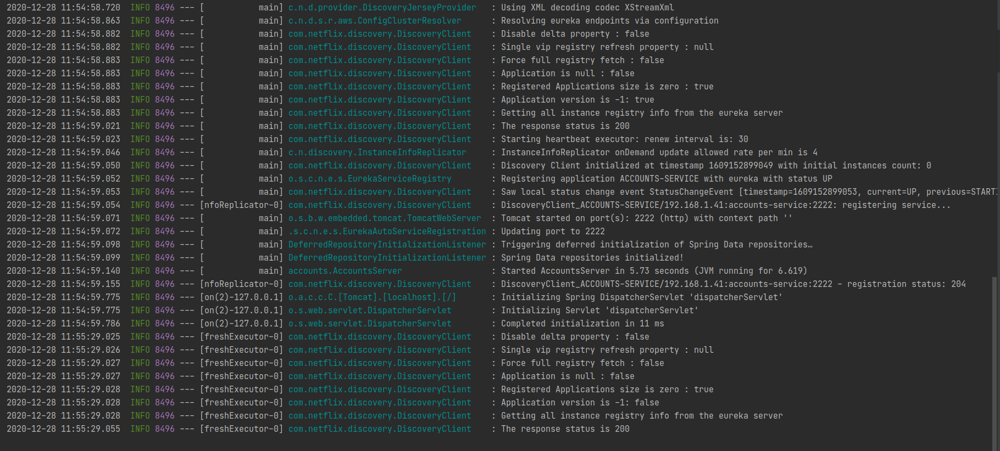
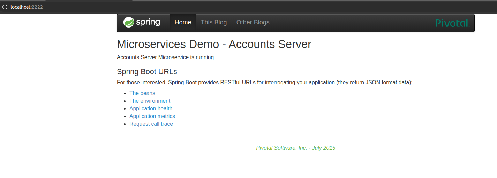
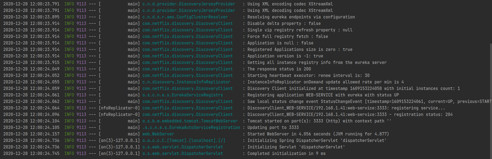
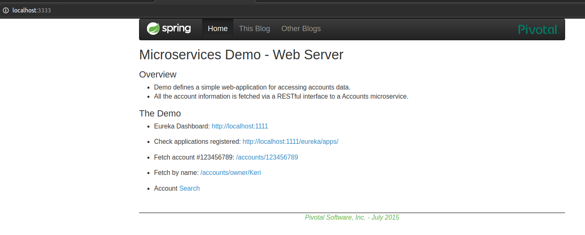
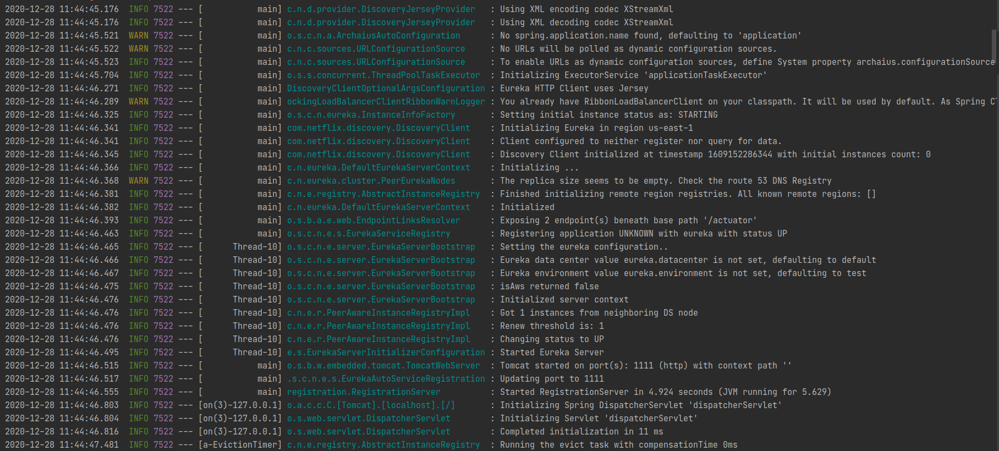
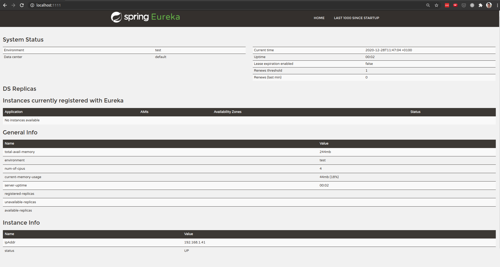
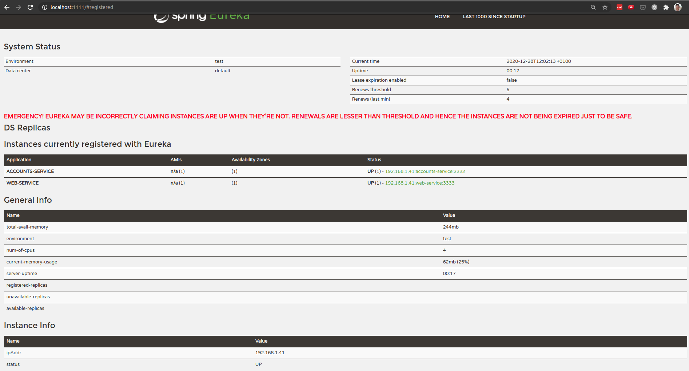
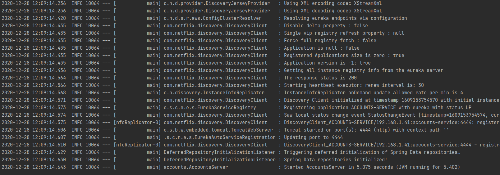
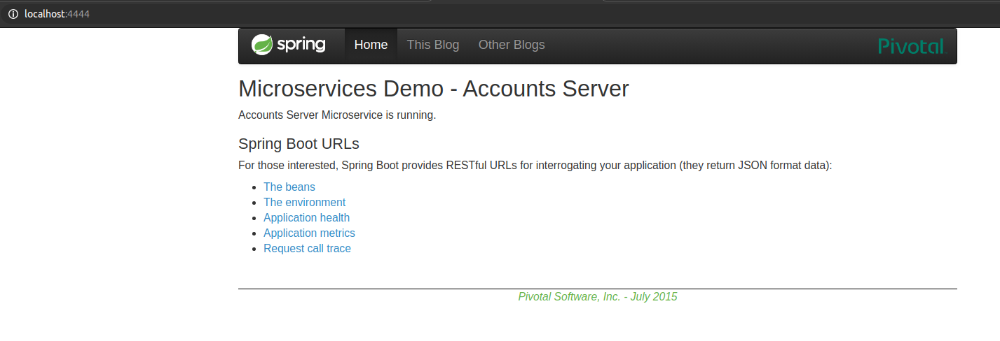
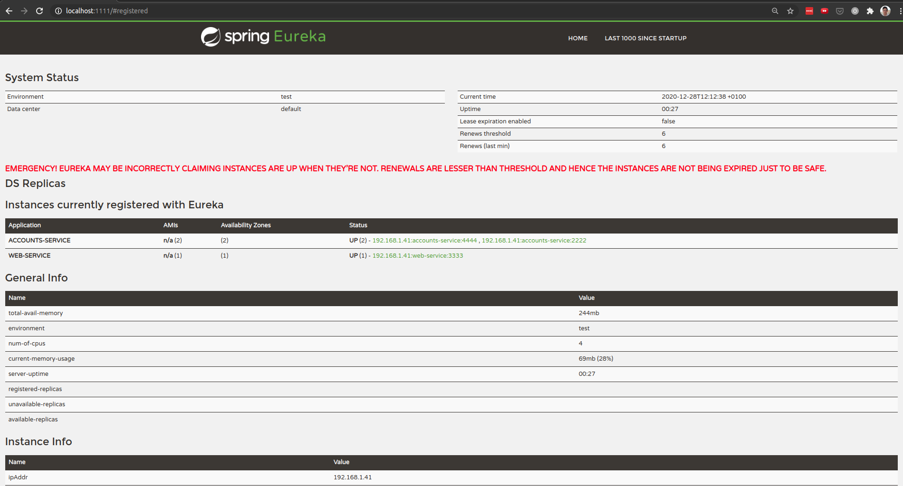

# Running Microservices: Report
- The two microservices `accounts (2222)` and `web` are running and registered (two terminals, logs screenshots)
    - Accounts (2222) (Terminal with logs and browser)
      
      
    - Web (Terminal with logs and browser)     
      
      
- The service registration service has these two microservices registered (a third terminal, dashboard screenshots)
    - Eureka started
      
    - Eureka with no services registered
      
    - Eureka with two services registered (`accounts (2222)` and `web`)
      
- A second `accounts` microservice instance started and using the port 4444. This second `accounts (4444)` is also registered (a fourth terminal, log screenshots)
    - Accounts (4444) (Terminal with logs and browser)
      
      
    - Eureka with three services started (`accounts (2222)`, `accounts (4444)` and `web`)
      
- What happens when you kill the microservice `accounts (2222)` and do requests to `web`? Can the web service provide information about the accounts again? Why?  
When the microservice is killed, if we do a request to `web` just after it will sometimes fail and sometimes success. This happens because the Eureka server has not updated the status of 
  the `accounts (2222)` and it redirects the request to that server sometimes. After Eureka has updated the status of `accounts (2222)` being down,
  all the requests start succeeding again because no more requests are routed to the port 2222.