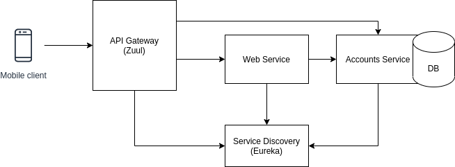
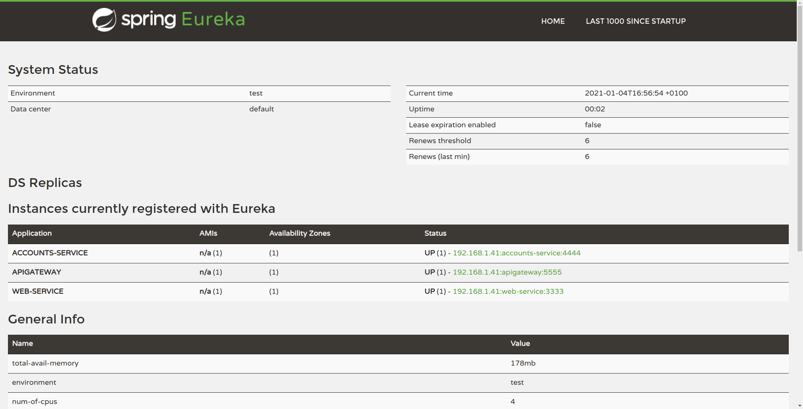
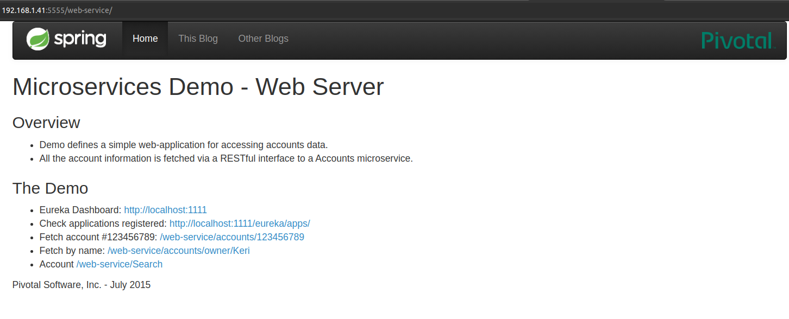
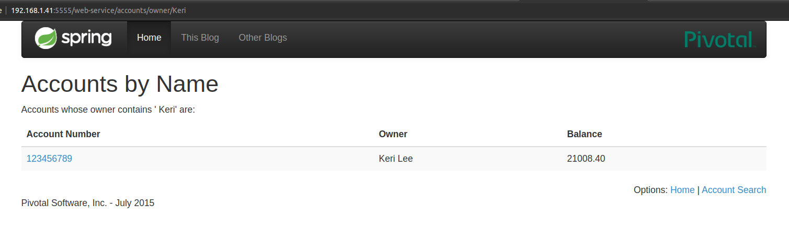
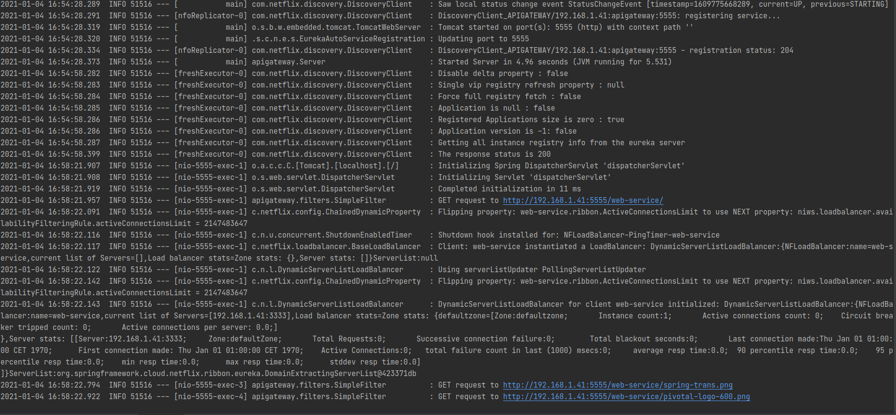

# API Gateway for Web and Registration
## Introduction
An API Gateway (Zuul) centralizes all the petitions to our microservices and all of the requests 
have to go through it.

This means that petitions that go through the API Gateway have to be transformed depending on the
microservices that they are going to. Zuul does this by declaring the following url structure for 
consuming the microservices through the API Gateway: 
`IP_ADDR:PORT/NAME_OF_MICROSERVICE/URL_OF_MICROSERVICE`. So, if we wanted to send a request to 
`/accounts` of the `web-service` microservice, we should send a request to 
`localhost:5555/web-service/accounts` where `localhost:5555` is the address of the API Gateway.

Zuul integrates with the Service Discovery (Eureka) as another client, so that the translation
between the logic name of the microservice and the ip and port is done automatically when a request
is sent to the API Gateway.

## Example of usage
First, let's show that the three services (API Gateway, Web and Accounts) are registered in Eureka:

Now, let's show the request to the home page of the webservice through the API Gateway:

Here, we can see how the URL contains the name of the webservice microservice.

We can see the information of the account of Keri Lee to make sure that a request goes from API 
Gateway to the WebService and from there, it makes another request to the AccountService to get the 
account information:

Finally, because we log all the request done to the API Gateway, we can see the ones we have made 
(in blue):

Here, the requests from the WebService to the AccountsService are not shown because they are directly
made, not through the API Gateway.

